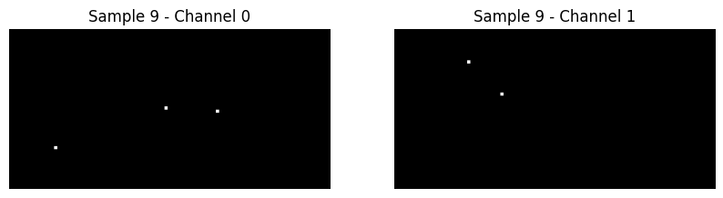

```{r setup, include=FALSE}
knitr::opts_chunk$set(echo   =FALSE,    
                      include=TRUE ,   
                      message=FALSE,    
                      warning=FALSE,   
                      comment=NA,       
                      fig.align="center",
                      fig.height = 8,     
                      fig.width = 12,     
                      dpi = 300           
                      )
```

```{=tex}
\begin{center}
Advised By: Professor Brian Macdonald
\end{center}
```
<br>

## Abstract

Mixed Doubles Curling is an offshoot of traditional curling, a sport where two teams take turns sliding stones down a sheet of ice towards a target. It has been called the "Wild West of Curling" due to its distinctive format and strategic complexity. Our goal is to take a given game state (looking at information available to players and coaches such as how many stones have been thrown and the positions of such stones) to generate a model that predicts the win percentage for each team. This model will be created using data from the Beijing 2022 Olympic Winter Games, and the World Mixed Doubles Curling Championship from 2023-2025. Using an XGBoost (Extreme Gradient Boosting) model with targeted feature generation, we managed to create a model that predicts the winner of an end given it's current state with 83% accuracy, giving us insight into how factors such as hammer possession and geometric "steal" probabilities affect the odds of a given team winning a game. Additionally, using a Convolutional Neural Network with just spatial and hammer data, we created a (sub-par) model that predicts the winner with 66% accuracy, highlighting the importance of human-given context in curling win prediction.

<br>

## Introduction

Curling is a sport where two teams take turns sliding stones down a sheet of ice towards a target. The most common form of the game features teams with four players, with each player getting two shots per round, known in curling as an “end”. When one player shoots, two of their teammates follow the stone down the ice, sweeping its path with brooms to direct it to the desired position. Teams score by having the stone closest to the center of the target at the completion of the end, one point for each stone inside of the opponent’s closest stone. After a set number of ends (usually 8 or 10), the team with more points is the winner.

This project will be focusing on a specific type of curling called "Mixed Doubles Curling" due to its distinctive format and strategic complexity. Mixed Doubles Curling features pre-positioned stones, power plays, and high strategic variance, which makes it a prime area to explore that currently has little existing analysis.

Given the huge number of potential analysis lines we can take, we have decided to focus on one of the most generalizable problems. "Given a specific game state, what is a probability of each team winning the game?" Not only does such analysis naturally allow us to answer other questions we might have about the game (such as how does having the hammer affect win probability? What about power plays?), but it also gives us a sense of structure by showing us how different factors of the game contribute to winning in order to focus future studies into the sport!

Our data set features 6 different csv files:

-   **Competition**: Features information about the 4 events in the dataset

-   **Competitors**: Players names and which competition they went to

-   **Ends**: End by end information, with results and whether the powerplay was used

-   **Games**: Results of each game, with the score each team got as well

-   **Stones**: Stone by stone analysis of each game. Lists stone positions as well. Points here refers to the supposed quality of the shot, and not the actual points received in the game.

-   **Teams**: Team names and country

Our analysis will mostly be focusing on the stones data set, with others mostly used to provide important context for that analysis.

This report begins by exploring the data and visualizing how things such as hammer possession and power play affect win probability on an end to end basis, and the raw probability of something like a last shot steal. The next section then discusses other models that we tried before settling into the XGBoost model, and then explains how we tuned that model to be successful. It also discusses the ongoing work on creating a convolutional neural network. In the final two sections, we discuss conclusions that we can draw from the models, and directions for future studies into mixed doubles curling.

<br>

## Data exploration and visualization

```{r}
# This line of code will run everything that we need. 
# When run for the first time, this will usually take about 5 minutes maximum.
# It is designed to be significantly faster after that
source("Main.R")
```

There are three important features of our data that is worth visualizing.

1)  How much of an advantage does the hammer confer to the players.

While one potential baseline to compare any of our models to is just a flat 50%, this is not a very useful baseline. Intuitively, the team that shoots the last stone has an advantage (being able to gauge the final game state and go for big steals or defends, with no risk of getting knocked out afterward). We can generate a better base line simply by seeing what the win percentage is for the team that has the hammer (last stone) compared to the team that doesn't have the hammer:

```{r}
print(hammer_plot)
```

We can see, quite clearly, that the team with the hammer generally wins the game 70% of the time. Not only is this a significantly better baseline to compare our models to, but it also suggests that controlling the final shot is an incredibly important feature to include in any models that we use!

A unique mechanic in mixed doubles curling is the existence of power plays, which is when the pre-positioned stones are moved from the center to the side, which allows for significantly more offensive plays or unique strategies. The power play can only be used by the team with the hammer, and we see the following win percentages for teams when the power play is active.

```{r}
print(powerplay_plot)
```

It's worth keeping in mind that this also accounts for the effect of having the hammer generally (power play by team 1 means that team 1 has the hammer, and same with team 2). This means that any effect must be tempered by the hammer effect as well. Despite this, we can clearly see that using the power play boosts the win rates of team that uses it (evidenced by the increase in the win rate of team 1 relative to the hammer when team 1 uses the power play, and the decrease in the win rate of team 1 relative to not having the hammer when 2 uses the power play).

This suggests that the power play is also important to consider in our models, but that its effect seems weaker overall compared to the hammer. There is also almost certainly an interaction between the two that is worth considering.

Possession of the hammer having such an influence on win rate suggests one of two possibilities:

1)  Having the even number shots is generally positionally preferable
2)  It is common to steal the winning point during the final shot itself

Presumably both of these might be true to a limited extent. Given that the first one is very difficult to quantify, we can try our luck at visualizing the second, seeing the possibility of winning by shot 9, and having that stolen on the final shot:

```{r}
print(steal_heatmap)
```

This heat map clearly shows us that roughly 30% of all final shots are steals. If we assume that both teams have an equal chance of winning, this means that the team with the hammer should win 50% + (30% of 50%) = 50% + 15% = 65% of the time. This means that much of the hammer's benefit is being able to steal the final shot, but there is also a bit more of a benefit it gives beyond just that alone.

We can visualize the state of the curling sheet right before a steal with a Voronoi diagram. In the following diagram, we can see the regions of the curling sheet that are closest to a stone from each team respectively. The center of the curling sheet is marked with a green X. Essentially, the winner of the end is the team that, after the next throw, "controls the center". In the instance below, if blue were to throw a stone such that the center of the sheet was within the blue region instead, then it would have "stolen" the win, as described above. This is why, despite the clear "winner" if we just take into account shot 9 being team 1 in this instance, it is so important that we model the probability of a steal in our model.

```{r}
print(voronoi_plot)
```

All of these visualizations help guide the features that we add to the final model!

<br>

## Modeling/Analysis

We can now begin with the creation of our model. Our model will be taking two large categories of predictors and using them to return a win probability for team 1. These categories of predictors are:

1.  Spatial information. Every single stone has an x and y axis, and this allows us to construct geographical information about the game state to examine which team is more likely to win

2.  Contextual information. Information such as which team has the hammer, the score leading up to this end, the number of shots we've already gone through are all information that we have access to beyond just the spatial information, and we can use such information to better inform our analysis.

There are a few simplifying assumptions that we are making:

-   Our model only looks at Winning vs. Not Winning for team 1, lumping losses and ties together
-   Our model only looks at game states at and after the halfway point (at the fifth shot and further). We noticed that states before that were too volatile to generate meaningful insight, leaving us at \~70% accuracy (just the hammer baseline)
-   Our model ignores relative strength of teams and previous team match ups, trying to generalize as much as possible to new game states.

Based on insights learnt from the above visualizations and thoughtful construction of what intuitively seemed like useful features, we engineered an initial XGBoost model (which effectively integrates several decision trees). Such a model is appropriate for this classification task (win or not win), and while it's not as intuitive to interpret as a logistic regression model, you can clearly see how much each variable improves performance in the overall model, which is a good proxy to see which variables matter more for this kind of prediction.

In order to evaluate and train our model, we used 5-fold cross validation on our data and split it into unique games, feeding entire ends into either the training or the test data set in order to prevent data leakage, and then measure accuracy by seeing how our model performs on the test data. Not splitting by game like this initially led to data leakage which artificially inflated our accuracy (we would simply split by the shot, which led to many similar states being fed into both the training and test dataset which significantly inflated our model performance).

This initial model had an accuracy of about 76%, a measly 6% improvement from the hammer baseline.

In order to improve this model, we trained a sub-model with a similar set of geometric features with the goal of predicting whether a steal was possible at the given game state. This model was trained and tested in the same way as the larger model above, and gave us a "Steal probability" variable to feed into the large model. This variable had a mean of around 29%, which aligns with the empirical expectation that we have seen before. Adding this into our overall model gives us significantly better accuracy of around 83%. This is still not a perfect model, but this is reasonable predictive power for such a volatile game, and shows that the contextual and spatial features do matter.

The exact variables and parameters used in the final model can be seen in the "Analysis.R" file and in appendix A.

Separately, we attempted to train a convolutional neural network for this dataset. As our previous XGBoost model incorporated many engineered predictors that gave the model context about the current game state, we attempted to create a model that would learn this context instead from the spatial data (x and y coordinates of stones only). While the data is not directly interpretable or visualizable due to the nature of the CNN, by running the file "CurlingCNN.ipynb" in google colab with the data, the reader can re-train the model to see the exact model architecture and the pattern of the train/val loss in training.

The spatial data for each game state was encoded using tensors of two channels (one channel for team 1 stones, and the other for team 2 stones). The dimensions of the tensor were then significantly reduced from the dimensions of the curling sheet (1500x3000 to 150x300) by max pooling. A visualization of the encoding of a single game state can be seen below:



The model was also given the information of which team has the hammer. Other than that, no additional information was fed to the model (which includes 20,000 game states, 10,000 of which are mirrored).

The data was split into 19,900 training game states and 100 testing game states. From here, 5 fold cross validation was used with binary cross entropy loss to train the CNN. Various levels of regularization were attempted to prevent overfitting to the training data.

After tuning of the model architecture and many alterations of the data encoding, the accuracy on unseen data appears to be only 66%. This was disappointing, as this accuracy is lower than our baseline of 70% (described above). Some potential explanations for this are detailed below.

<br>

## Visualization and interpretation of the results

Using the plot below, we can see that the model, intuitively, performs better for later shots:

```{r}
print(accuracy_plot)
```

We can see that the model follows a rise from around \~70% accuracy in the earlier shots (a trend that would continue to stay true for shots 1 to 4) to around a stable 83% accuracy at the later shots that are not the final one.

We can make a plot to see how much each predictor contributes to our model's success:

```{r}
print(importance_plot)
```

Some of these important variables include:

1.  Steal Probability - Our constructed variable is one of our model's best predictors, likely as it provides a lot of information about the staying power of a current lead.

2.  Closest Advantage - The raw difference between the second teams closest stone and team 1's closest stone. A greater number means that team 1 has a closer stone to the house.

3.  Hammer - Self explanatory. We have already seen above how important this is.

4.  Steal pressure - This refers to the interaction between steal probability and how far along the game we are.

The other values capture subtle geometric information that adds up to help improve the model's predictive power.

As for the interpretation of the convolutional neural network results, the low prediction acccuracy is likely a factor of the training dataset itself, which included game states after shot 5. The lack of "generalizability" of features of the curling sheet BETWEEN game states and their relevance in predicting end outcome is likely the culprit here. Additionally, for a CNN of this style and for data this sparse, it appears that 20,000 data points may not be sufficient.

## Conclusions and recommendations

In summary, our random forest model was able to predict the final winner of each end of a curling match with a total accuracy of around 83% for the last 7 game states. In comparison to the known baseline accuracy for win prediction of 70% (just based on team with the hammer), our model is slightly better at predicting the winner of an end using our additional constructed variables.

Our convolutional neural network has proven to be less accurate. With only spatial data and no constructed variables, it seems that there is not enough data for the model to learn how to classify the winner of the end. The accuracy is not much better than random guessing (a bit over 50%), and it is much lower than our baseline of 70%.

This points to some future directions in developing a more accurate model for classifying the winner of each end. Perhaps changing the way the data is encoded would improve model accuracy (including previous game states, changing the model architecture, including more data, etc.). It is likely that the model is limited by issues with CNN structure. We would like to explore in the future how "stacking" game states would potentially allow the model to see progression between states rather than static game states, as this may affect the winner prediction (based on superior strategy, for example). Additionally, we would like to see if training on just the final game state(s) all together (stacked) could be used to accurately predict whether a "steal" occurred in the final shot. This could be more accurate, and more descriptive in terms of an interpretable and useful model in determining a team's defense efficacy.

Another future direction for this analysis would be to look into specific moves that changed the expected winner of the end. Perhaps looking at the influence of power plays on win probability as well as whether certain types of plays move the needle more than others. Finally, looking more into the strategy of individual teams could be an additional interesting direction, and looking at whether teams that use certain strategies perform better against certain teams could provide some interesting information as well.

## Data Sources & References

-   **Data**: [CSAS Github](https://github.com/CSAS-Data-Challenge/2026)
-   **Curling Rules**: [World Curling Federation](https://worldcurling.org/about/curling/)
-   **Data set and Challenge Information**: [CSAS 2026 Data Challenge](https://statds.org/events/csas2026/challenge.html)

## Appendix A - Specifications of the XGBoost Model

The following code snippet doesn't run, but contains all of the information necessary to understand the full XGBoost model used in the report.

```{r, echo = TRUE, eval = FALSE}

final_features <- c(
  "ScoreDiff", "EndsRemaining", "ScoreDiff_x_Hammer", 
  "ScoreDiff_x_EndsRemaining",
  "Hammer", "StoneAdv", "ClosestAdv", "Stones_On_Ice", "ShotID",
  "Current_Score_Team1",
  "Center_Line_Blockers", "Button_Is_Open",
  "LateralOffsetAdv", "StonesHiddenAdv",
  "GuardQualityAdv",
  "xSteal_Prob", "Steal_Pressure", "Hammer_x_StealProb",
  "Team1_Using_PowerPlay", "Team2_Using_PowerPlay",
  "Team1_Cluster_Score", "Team2_Cluster_Score", "Cluster_Diff",
  "Team1_Vertical_Spread", "Team2_Vertical_Spread"
)

model_data <- model_data %>% filter(!is.na(Win), !is.na(Hammer))

final_matrix <- as.matrix(model_data[, final_features])
final_y <- model_data$Win
final_matrix[is.na(final_matrix)] <- 0

if (file.exists(main_model_path) && file.exists(cv_preds_path)) {
  xgb_model_cv <- readRDS(main_model_path)
  oof_preds_df <- readRDS(cv_preds_path)
  importance_matrix <- readRDS(importance_path)
} else {
  
  xgb_model_cv <- train(
    x = final_matrix,
    y = factor(final_y, levels = c(0, 1), labels = c("Loss", "Win")),
    method = "xgbTree",
    trControl = train_control,
    metric = "ROC",
    tuneGrid = data.frame(
      nrounds = 600,
      max_depth = 7,
      eta = 0.05,
      gamma = 0,
      colsample_bytree = 0.8,
      min_child_weight = 1,
      subsample = 0.8
    )
  )
  
  oof_preds_df <- xgb_model_cv$pred %>% arrange(rowIndex)
  
  xgb_model_final <- xgboost(
    data = final_matrix,
    label = final_y,
    nrounds = 600,
    max_depth = 7,
    eta = 0.05,
    subsample = 0.8,
    colsample_bytree = 0.8,
    objective = "binary:logistic",
    eval_metric = "logloss",
    verbose = 0
  )
  
  importance_matrix <- xgb.importance(feature_names = final_features, 
                                      model = xgb_model_final)
  saveRDS(xgb_model_cv, main_model_path)
  saveRDS(oof_preds_df, cv_preds_path)
  saveRDS(importance_matrix, importance_path)
}
```
